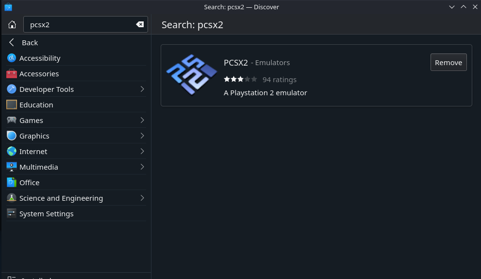
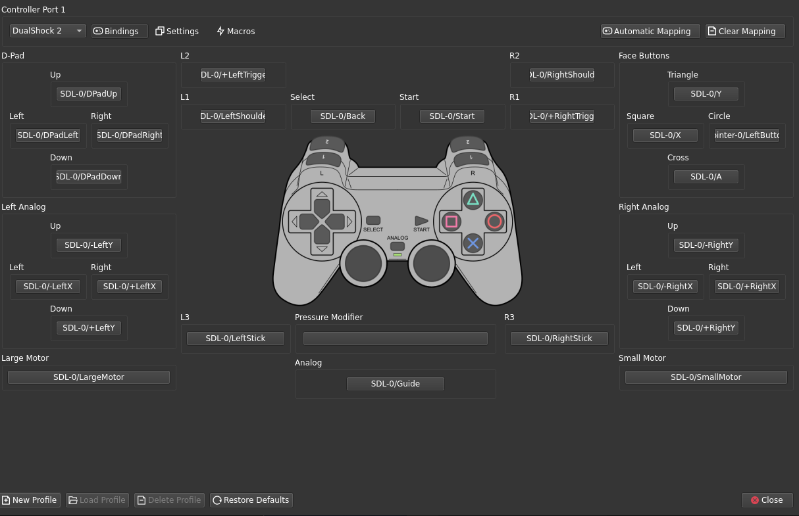

# Socom2-SteamDeck
Socom 2 setup guide for Steam Deck and Socom Community server

# Table of Contents

- [Installing PCSX2](#installing-pcsx2)

- [Installing Flatseal](#installing-flatseal)

- [Permissions](#permissions)

- [PCSX2 Setup and Settings](#pcsx2-setup-and-settings)

- [Controller Binds](#controller-binds)

- [Running in Game Mode](#running-in-game-mode)

- [Final Notes](#final-notes)

## Installing PCSX2

To install PCSX2 you must be in Desktop mode on the Steam Deck. You can enter Desktop mode by pressing the Steam button and scrolling down until you see the Power option. Select Power and choose "Switch to Desktop Mode"

In Desktop Mode the Discover store icon is on the bottom menu bar - this is where you will find the PCSX2 application.


You can type pcsx2 in the search bar and click Install when it pops up. This will install the most recent version of PCSX2 1.7



Once installed PCSX2 will be located under games in the Steam Decks "start" menu. There will be two builds, the WXWidgets, and newer QT build


## Installing Flatseal

As applications on the Steam Deck are installed as FlatPaks they will run in a sandbox. PCSX2 does not come natively with the ability to access the network or filesystem on the Steam Deck so the Flatseal application is used to grant PCSX2 these permissions.

Flatseal can be installed from the Discover store just as PCSX2 is


Once installed Flatseal can be found under Utilities in the "start" menu


## Permissions

To use the network PCSX2 needs the Network permission toggle switched on. To access the host filesystem and add the Socom 2 HDD with maps it will need filesystem permissions. These can be toggled by opening Flatseal, selecting net.pcsx2.PCSX2 and toggling the appropriate switches.

The first swtich is network


And then All System Files to ensure that you can add the HDD for maps


## PCSX2 Setup and Settings

General setup follows a similar path to the [Socom Community](https://www.socomcommunity.com) guide.

For the BIOS I have noticed that ps2-0220a-20060905.bin works and networking works. If you do these steps with a different BIOS and networking is not working then this is a good place to look and troubleshoot

### Graphics


Under graphics I currently use the Vulkan Renderer and select the AMD RADV VANGOH adapter. I have fit to Window/Screen selected as well.


For rendering I have internal resolution set to 2x Native (720p) Otherwise most other settings are pretty much default or turned off.


Finally in Texture Replacement the box for Precache Texture should be checked when using the vulkan renderer per [this Reddit thread](https://www.reddit.com/r/PCSX2/comments/sdhren/games_running_worse_in_vulkan/)


### Network

For networking check the box for enable and choose Sockets. You can leave Auto or choose the Wlan0 interface

For the HDD Check Enabled and browse to the SOCOM II HDD.raw file and select it


## Controller Binds

The QT build of PCSX2 can natively detect the Steam Deck buttons so binding should be automatic. 

In order to bind a crouch/stand there are a few options. The author used the following steps

- Bind Pressure Modifier to SDL-0/LeftStick and set the modifier to 0.20x

- Enable the back grip buttons in the controller settings on game mode

- Still in Game Mode - bind R4 to left stick click

- Then add a subcommand to press the Y button (triangle)

- Bind L4 to triangle

This setup allows you to use the grip buttons to quickly prone/stand in game without sacrificing the circle button - the only caveat being that if you accidentally hold the crouch/stand you will change your fire rate.




## Running in Game Mode

This step is optional but you recommended as in Game Mode on the Steam Deck you have the ability to force higher GPU clock speeds, and utilize FSR scaling for external displays.

To add Socom 2 to Game mode you want to open your library and click Add A Game in the lower left corner then select Add a Non Steam Game.


From there select the version of PCSX2 you are using (WXWidgets or QT) and it will show up in your library.

Optionally you can launch Socom 2 by editing your launch options. By Right Clicking the PCSX2 game in your library and selecting Properties you can change the launch options as follows - inserting your file path in the angle brackets <>

```
run --branch=stable --arch=x86_64 --command=pcsx2-qt net.pcsx2.PCSX2 -elf <path-to-your-elf-file> "<path-to-your-SOCOM-2-ISO>"
```


## Final Notes

Once this is complete you should be able to follow the guide on [Socom Community](https://socomcommunity.com/guides/socom2) to get DNS set up and find the HDD maps.